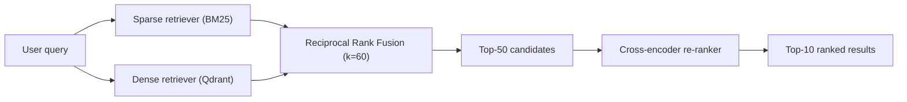

# Comparative Examples: Technical Documentation (.md / .html)

This document contrasts a technical architecture specification written in standard AI Slop style against the same specification authored under the `anti-slop-scientific-writer` guidelines.

---

## Example Scenario: Hybrid Retrieval Architecture Specification

### ❌ Bad Architecture Specification (AI Slop Style)

```markdown
# Navigating The Vector Retrieval Landscape In ACDP

In this section, we will delve into the rich tapestry of modern search technologies. The ACDP platform leverages a seamless, robust, and groundbreaking hybrid search architecture that stands as a beacon for academic competition discovery.

The challenge facing students is not the volume of information — it is the inability to find it. Traditional keyword search is dead. 

- **Vector Search**: Embeddings quietly capture semantic nuances, fostering unprecedented discovery accuracy.
- **BM25 Search**: Traditional inverted indices play a vital and crucial role in exact keyword matching.
- **Reranker**: A cross-encoder model elevates search precision to brand new heights.

The result? A truly transformative user experience.

### In Conclusion
In summary, this section has explored how the hybrid approach brings together the best of both worlds. By combining dense and sparse retrieval, the platform is now fully equipped to revolutionize how students connect with competitions.
```

#### Diagnostic Audit by `detect_ai_slop.py`:
- 🔴 **Slop Score: 68/100 (REWRITE REQUIRED)**
- ❌ Title Case heading (*"Navigating The Vector Retrieval Landscape In ACDP"*)
- ❌ Preamble (*"In this section, we will delve into the rich tapestry..."*)
- ❌ Forbidden words: *delve, tapestry, landscape, seamless, robust, groundbreaking, beacon, quietly, foster, vital, crucial, elevate, revolutionize*
- ❌ Negative parallelism (*"The challenge facing students is not the volume of information — it is..."*)
- ❌ Monotonous bold-first bullets
- ❌ Hypophora drama (*"The result? A truly transformative..."*)
- ❌ Fractal conclusion (*"### In Conclusion / In summary, this section has explored..."*)

---

### ✅ Good Architecture Specification (Applied `anti-slop-scientific-writer`)

```markdown
# Hybrid retrieval architecture and ranking pipeline

The ACDP search service combines lexical matching (BM25) with dense semantic retrieval (Qdrant) to resolve both exact keyword queries (competition acronyms, organizer codes) and natural language queries (research themes, student eligibility).

## Retrieval and ranking pipeline



## Component specifications

| Component | Technology | Configuration & Parameters |
| :--- | :--- | :--- |
| Sparse index | BM25 (PostgreSQL `pg_trgm` + tsvector) | $k_1 = 1.2$, $b = 0.75$, Vietnamese stopwords removed |
| Dense index | Qdrant v1.19+ | `bge-m3` (1024-dim), Cosine distance, HNSW ($M=16, efSearch=64$) |
| Fusion | Reciprocal Rank Fusion (RRF) | Constant $k = 60$, candidate pool $= 50$ documents |
| Re-ranker | Cross-Encoder (`bge-reranker-large`) | Sequence length $= 512$, batch size $= 16$ |

Empirical benchmarks on 1,200 labeled student queries show that this hybrid pipeline improves Hit Rate@5 from 0.61 (dense-only) and 0.54 (sparse-only) to 0.83, maintaining a p95 retrieval latency of 94 ms.
```

#### Diagnostic Audit by `detect_ai_slop.py`:
- 🟢 **Slop Score: 0/100 (PRISTINE SCIENTIFIC PROSE)**
- ✅ Sentence case headings
- ✅ Diagram replaces wordy narrative
- ✅ Markdown table for dimensional specifications
- ✅ Quantitative empirical evidence (Hit Rate@5: 0.61 / 0.54 $\rightarrow$ 0.83; p95 latency: 94 ms)
- ✅ Zero filler words, zero preambles, zero fractal conclusions
