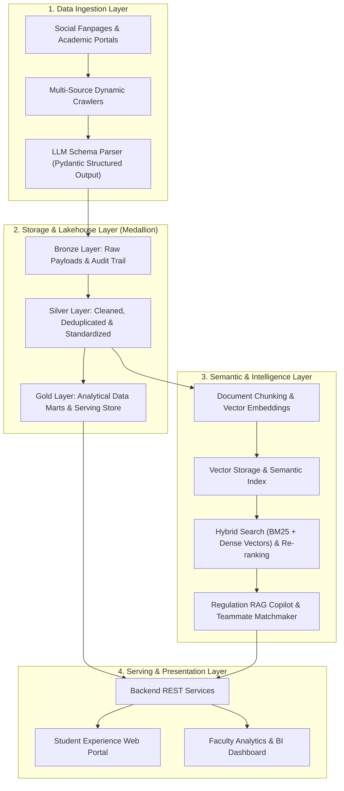

# ACDP: Academic Competition Discovery Platform
> **Building a Data Pipeline and Platform for Academic Competition Discovery, Knowledge Management, and Teammate Recommendation**

[](LICENSE)
[](https://www.python.org/)
[](https://www.docker.com/)
[](docs/rd-tasks/)

An end-to-end data platform that automates academic competition ingestion, provides RAG-powered regulation query assistants, enables intelligent teammate matchmaking, and delivers faculty-level analytical dashboards.

---

[Overview](#overview) • [Key Features](#key-features) • [Architecture](#system-architecture) • [Tech Stack](#tech-stack) • [Documentation](docs/README.md) • [User & AI Guide](docs/HOW_TO_USE.md) • [Getting Started](#getting-started) • [Contributors & Advisor](#contributors--advisor)

---

## Overview

Academic competitions, hackathons, and high-impact talent programs (e.g., ICPC, National Student Olympiad in Informatics, Euréka, Student Scientific Research, Samsung Innovation Campus, VinUni AI) are vital for students to gain hands-on technical experience. However, students and academic institutions face core challenges:

- **Scattered Information**: Announcements are fragmented across external portals and social media fanpages, causing missed registration deadlines.
- **Rule Navigation & Knowledge Gap**: Complex rulebooks and the absence of centralized historical repositories (past prompts, solutions, guidelines) hinder preparation.
- **Team Formation & Mentorship Friction**: Difficulties in identifying cross-functional peers (e.g., pairing Frontend with Data/AI engineers) and connecting with faculty advisors whose research matches the competition theme.
- **Lack of Institutional Visibility**: Faculty leadership lacks consolidated analytics on student engagement, domain trends, and award tracking.

**ACDP** solves these challenges with a modern Data Engineering stack: automated multi-source web ingestion, Medallion Lakehouse storage, a Hybrid-Search RAG regulation assistant, vector-based teammate recommendation, and an interactive student web portal with administrative analytics.

---

## Key Features

- **Automated Multi-Source Data Ingestion**: Dynamic crawlers collect competition announcements across academic portals and social media; LLMs enforce structured JSON schemas via Pydantic.
- **Medallion Lakehouse Architecture**: Tiered data processing (`Bronze` raw payload $\rightarrow$ `Silver` cleaned & deduplicated $\rightarrow$ `Gold` curated data marts) ensuring data integrity, auditability, and time-travel capability.
- **AI-Powered Regulation Copilot**: Hybrid Search (lexical BM25 + dense vector retrieval) with re-ranking, strictly grounded in official contest regulations.
- **Intelligent Teammate & Advisor Matchmaking**: Semantic similarity and heuristic constraints match students with complementary skills and align student teams with faculty research interests.
- **Interactive Student Portal & BI Dashboard**: Modern responsive web application and administrative dashboards tracking competition trends.

---

## System Architecture



---

## Technology Governance & Active R&D Phase

> [!NOTE]
> **Active R&D Inception Phase (Tabula Rasa - DIR-011)**:  
> All technology choices across storage layers, table formats, ingestion frameworks, vector retrieval, and web serving are currently undergoing rigorous, first-principles academic research and empirical benchmarking under [`docs/rd-tasks/`](docs/rd-tasks/).
> 
> In accordance with the team's research charter, **no tech stack is pre-decided or locked in**. Technologies are selected only after comprehensive feasibility analysis, quantitative benchmarking, and formal cross-defense between the co-authors before issuing final Architecture Decision Records (ADRs).

| Architecture Layer | R&D Research Scope | Evaluation Status | Active Task / Deliverable |
| :--- | :--- | :---: | :--- |
| **Bronze Layer Storage & Format** | Object Storage (Local POSIX, SeaweedFS, Cloudflare R2) & Open Table Formats (Delta Lake `delta-rs`, Apache Iceberg, Lance) | 🔄 Ready for Peer Debate | [`T13.md`](docs/rd-tasks/T13.md) / [`NT-018`](docs/deliverables/NT-018-bronze-storage-and-table-format-evaluation.md) |
| **Ingestion & Crawling** | Multi-source dynamic scrapers (Playwright, Crawl4AI) & Pydantic extraction | 🔄 Ready for Peer Debate | [`T02.md`](docs/rd-tasks/T02.md) / [`NT-014`](docs/deliverables/NT-014-competition-landscape-survey.md) |
| **System Architecture & Data Flow** | Overall Lakehouse architecture, serving layer, and pipeline orchestration | 🔄 Ready for Peer Debate | [`T08_v2.md`](docs/rd-tasks/T08_v2.md) / `NT-017` |
| **Business & Technical Feasibility** | Core business requirements, constraints, and lean engineering validation | ✅ Complete & Approved | [`T01.md`](docs/rd-tasks/T01.md) / [`NT-013`](docs/deliverables/NT-013-business-technical-feasibility-review.md) |
| **Semantic Intelligence & Vector Search** | Hybrid retrieval (BM25 + Dense Vectors), Cross-Encoder re-ranking | ⏳ Scheduled | Phase 1 Backlog (`NT-012`) |

---

## Roadmap & Project Scope

The project is conducted within the **Major in Data Engineering**, Faculty of Information Technology at Ho Chi Minh City University of Technology and Engineering (HCMUTE), structured across two consecutive phases:

### Phase 1: Special Topic Project (Tiểu luận chuyên ngành - 15-Week MVP)
- [x] Problem formulation, data schema design, and architectural modeling.
- [ ] Multi-source ingestion pipeline covering 5–10 key competition sources.
- [ ] Medallion Lakehouse implementation with event deduplication and validation rules.
- [ ] Core RAG copilot for contest rules and guideline Q&A.
- [ ] MVP web portal for contest exploration and assistant queries.
- [ ] Faculty analytics dashboard displaying contest distributions by domain.

### Phase 2: Graduation Thesis (Khóa luận tốt nghiệp - 15-Week Full System)
- [ ] Real-time streaming ingestion via webhooks and live event feeds.
- [ ] Production teammate recommendation algorithm and faculty research matchmaking.
- [ ] Historical knowledge repository with past winning solutions and project playbooks.
- [ ] Automated commendation proposals and student activity credit integration.
- [ ] Departmental administrative portal and multi-channel notification bots (Telegram/Discord).

---

## Getting Started

### Prerequisites
- [Docker](https://docs.docker.com/get-docker/) & [Docker Compose v2.30+](https://docs.docker.com/compose/)
- [Python 3.13+](https://www.python.org/downloads/)
- [Node.js 22 LTS](https://nodejs.org/) & [pnpm](https://pnpm.io/) or `npm`

### Environment Configuration
Create a `.env` file in the project root:
```bash
cp .env.example .env
```
Configure necessary credentials:
```env
# Database & Vector DB
POSTGRES_USER=postgres
POSTGRES_PASSWORD=postgres
POSTGRES_DB=acdp_db
QDRANT_URL=http://localhost:6333

# LLM Providers
OPENAI_API_KEY=your_openai_api_key
# or GEMINI_API_KEY=your_gemini_api_key

# Services
API_HOST=0.0.0.0
API_PORT=8000
NEXT_PUBLIC_API_URL=http://localhost:8000
```

### Running with Docker Compose
Start all database, vector store, backend, and frontend services:
```bash
docker-compose up -d --build
```
- **Web Application Portal**: `http://localhost:3000`
- **Backend API Documentation**: `http://localhost:8000/docs`

---

## Contributors & Advisor

### Core Authors
- **Do Kien Hung (Đỗ Kiến Hưng)**  
  Student ID: `23133030`  
  Major in Data Engineering, Faculty of Information Technology  
  Ho Chi Minh City University of Technology and Engineering (HCMUTE)  
  GitHub: [@darktheDE](https://github.com/darktheDE)

- **Nguyen Van Quang Duy (Nguyễn Văn Quang Duy)**  
  Student ID: `23110086`  
  Major in Data Engineering, Faculty of Information Technology  
  Ho Chi Minh City University of Technology and Engineering (HCMUTE)  
  GitHub: [@QuangDuyReal](https://github.com/QuangDuyReal)

### Scientific Advisor
- **M.Sc. Tran Quang Khai (ThS. Trần Quang Khải)**  
  Lecturer, Faculty of Information Technology  
  Ho Chi Minh City University of Technology and Engineering (HCMUTE)

---

## License

This project is licensed under the [MIT License](LICENSE).
