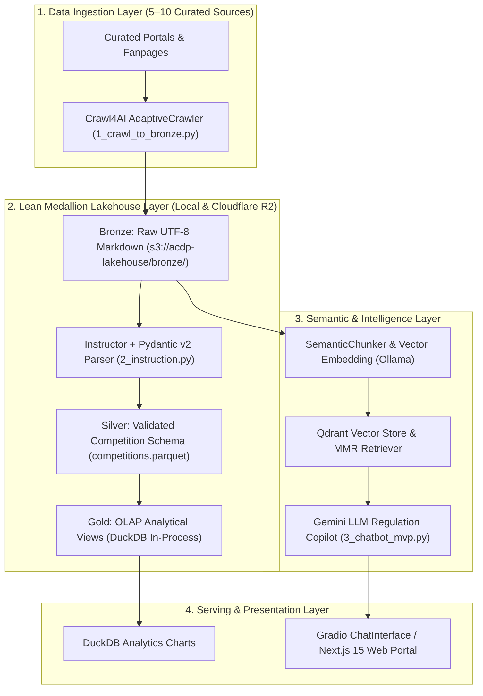

# ACDP: Academic Competition Discovery Platform
> **Building a Lean Data Lakehouse and RAG Platform for Academic Competition Discovery and Knowledge Management**

[](LICENSE)
[](https://www.python.org/)
[](https://docs.astral.sh/uv/)
[](docs/tasks/roadmap.md)
[](tests/)

An end-to-end data engineering platform developed at **Trường Đại học Công nghệ Kỹ thuật TP.HCM (HCM-UTE)** that automates competition discovery, provides a RAG-powered regulation query copilot, and delivers analytical OLAP marts.

---

## 1. Overview & Problem Statement

Academic hackathons, coding contests, and research challenges are crucial for student development. However, notices and rulebooks are fragmented across dynamic websites and social media, leading to missed deadlines and information asymmetry. 

**ACDP** addresses this challenge with a two-phase academic roadmap:
- **Phase 1 — Special Topic Project (Tiểu luận chuyên ngành - TLCN)**: Simulates the platform end-to-end and validates technical feasibility over **5–10 representative competitions** using a minimalist, zero-overhead stack ([DIR-015](docs/frameworks/TEAM_DIRECTIVES.md)).
- **Phase 2 — Graduation Thesis (Khóa luận tốt nghiệp - KLTN)**: Scales to automated nationwide multi-source crawling, fuzzy entity deduplication, and production teammate recommendation.

*For formal academic proposals and literature reviews, see [`docs/academic/Proposal_NCKH_TLCN.md`](docs/academic/Proposal_NCKH_TLCN.md).*

---

## 2. System Architecture


```mermaid
flowchart TD
    subgraph Ingestion["1. Data Ingestion Layer (5–10 Curated Sources)"]
        A["Curated Portals & Fanpages"] --> B["Crawl4AI AdaptiveCrawler (1_crawl_to_bronze.py)"]
    end

    subgraph Lakehouse["2. Lean Medallion Lakehouse Layer (Local & Cloudflare R2)"]
        B --> C["Bronze: Raw UTF-8 Markdown (s3://acdp-lakehouse/bronze/)"]
        C --> D["Instructor + Pydantic v2 Parser (2_instruction.py)"]
        D --> E["Silver: Validated Competition Schema (competitions.parquet)"]
        E --> F["Gold: OLAP Analytical Views (DuckDB In-Process)"]
    end

    subgraph Intelligence["3. Semantic & Intelligence Layer"]
        C --> G["SemanticChunker & Vector Embedding (Ollama)"]
        G --> H["Qdrant Vector Store & MMR Retriever"]
        H --> I["Gemini LLM Regulation Copilot (3_chatbot_mvp.py)"]
    end

    subgraph Serving["4. Serving & Presentation Layer"]
        F --> J["DuckDB Analytics Charts"]
        I --> K["Gradio ChatInterface / Next.js 15 Web Portal"]
    end
```

---

## 3. Medallion Pipeline & Tech Stack

| Lakehouse Tier | Processing Scope & Target | Core Technology | Source Module |
| :--- | :--- | :--- | :--- |
| **Bronze Layer** | Raw, lossless Markdown capture from dynamic web pages | `Crawl4AI` (`AdaptiveCrawler`) + `Cloudflare R2` (S3) | [`src/acdp/1_crawl_to_bronze.py`](src/acdp/1_crawl_to_bronze.py) |
| **Silver Layer** | Pydantic v2 structured extraction with few-shot prompting | `Instructor` + `LiteLLM` + `Pydantic v2` | [`src/acdp/2_instruction.py`](src/acdp/2_instruction.py), [`schemas.py`](src/acdp/schemas.py) |
| **Gold Layer** | In-process SQL OLAP analytics over Silver Parquet | **DuckDB** (`httpfs` extension) | [`src/acdp/config.py`](src/acdp/config.py), [`data/README.md`](data/README.md) |
| **Semantic RAG** | Regulation clause chunking, vector retrieval & chat UI | `Qdrant` + `Ollama` + `Google GenAI` + `Gradio` | [`src/acdp/3_chatbot_mvp.py`](src/acdp/3_chatbot_mvp.py) |

---

## 4. Repository Layout

```text
acdp-platform/
├── src/acdp/               # Core data pipeline and application modules
│   ├── 1_crawl_to_bronze.py    # Crawl4AI ingestion to Cloudflare R2 Bronze
│   ├── 2_instruction.py        # Instructor few-shot extraction to Silver JSON
│   ├── 3_chatbot_mvp.py        # RAG Regulation Chatbot with Qdrant & Gradio
│   ├── config.py               # Application & storage configuration (AppConfig)
│   └── schemas.py              # Pydantic v2 data contracts (Competition, PrizeTier)
├── data/
│   ├── raw/markdown/       # Curated fixtures for 7 reproducible sample competitions
│   └── lakehouse/          # Local Medallion tiers (Bronze, Silver, Gold, DuckDB)
├── tests/                  # Unit and integration test suites (100% Passed)
├── docs/                   # Academic manuscripts, architecture specs, ADRs, roadmap
│   ├── academic/           # TLCN report draft, registration & NCKH proposal
│   ├── specs/              # Technical specifications (SPEC-0001, SPEC-0002)
│   └── tasks/              # Active sprint context, Notion mapping & 15-week roadmap
├── pyproject.toml          # Python dependencies & build specification (uv)
└── README.md
```

---

## 5. Quickstart

### Step 1: Install Dependencies
```bash
uv sync
```

### Step 2: Configure Environment
Copy the template and provide your API keys:
```bash
cp .env.example .env
```
*(Required for Cloudflare R2 sync: `AWS_ENDPOINT_URL`, `AWS_ACCESS_KEY_ID`, `AWS_SECRET_ACCESS_KEY`; for RAG: `GEMINI_API_KEY`).*

### Step 3: Run Verification & Pipeline
```bash
# 1. Run unit tests
uv run pytest -v

# 2. Ingest competition pages to Bronze (R2 / Local)
uv run python src/acdp/1_crawl_to_bronze.py

# 3. Extract structured Silver schema using Instructor
uv run python src/acdp/2_instruction.py --extract

# 4. Launch RAG Regulation Chatbot (Gradio UI)
uv run python src/acdp/3_chatbot_mvp.py --chat
```

---

## 6. Academic Documentation Hub

- **Báo cáo Tiến độ GVHD**: [`docs/academic/KeHoach_TienDo_BaoCao_GVHD.md`](docs/academic/KeHoach_TienDo_BaoCao_GVHD.md)
- **Bản thảo Báo cáo TLCN**: [`docs/academic/BaoCao_TieuLuan_ChuyenNganh_KTDL.md`](docs/academic/BaoCao_TieuLuan_ChuyenNganh_KTDL.md)
- **Đặc tả Kiến trúc (SPEC-0001 & SPEC-0002)**: [`docs/specs/`](docs/specs/)
- **Kế hoạch 15 Tuần & Active Sprint**: [`docs/tasks/roadmap.md`](docs/tasks/roadmap.md) • [`docs/tasks/active-sprint.md`](docs/tasks/active-sprint.md)

---

## 7. Contributors & Scientific Advisor

### Core Authors
- **Đỗ Kiến Hưng** (MSSV: `23133030`) — Data Engineering, FIT, HCM-UTE — [@darktheDE](https://github.com/darktheDE)
- **Nguyễn Văn Quang Duy** (MSSV: `23110086`) — Data Engineering, FIT, HCM-UTE — [@QuangDuyReal](https://github.com/QuangDuyReal)

### Scientific Advisor
- **ThS. Trần Quang Khải** — Giảng viên Khoa Công nghệ Thông tin, Trường Đại học Công nghệ Kỹ thuật TP.HCM (HCM-UTE)

---

## 8. License

This repository is licensed under the [MIT License](LICENSE).
