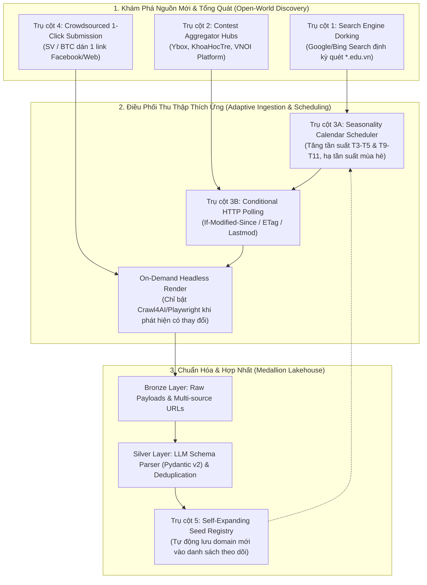
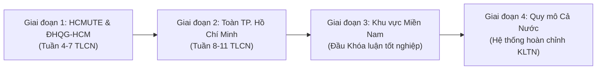

# DELIVERABLE: Academic Competition Landscape Survey, Previous Work & Generalized Adaptive Ingestion Architecture

- **Notion Task ID**: `NT-014`
- **Related Sprint**: Sprint 01 (Week 1–Week 3: Foundation, Harness & Ingestion Design)
- **Primary Owner**: Do Kien Hung & Nguyen Van Quang Duy
- **Date Completed**: 2026-09-11
- **Deliverable Type**: Field Survey, Academic Literature Grounding & Generalized Ingestion Architecture
- **Status**: Complete & Verified

---

## 1. Executive Summary & Objective

Tài liệu này giải quyết toàn diện bài toán **Khảo sát hệ sinh thái cuộc thi học thuật CNTT/KTDL** và **Tổng quát hóa kiến trúc thu thập dữ liệu (Generalized Adaptive Ingestion)**.

### Vấn Đề Thực Tế Được Tháo Gỡ:
1. **Nghịch lý Mùa vụ (Seasonality)**: Các cuộc thi diễn ra theo chu kỳ tập trung vào 2 đợt cao điểm trong năm (HK2: T3–T5 và HK1: T9–T11). Việc cào mù liên tục quanh năm gây lãng phí 90% tài nguyên tính toán.
2. **Nghịch lý Nguồn Đóng (Closed-World Assumption)**: Việc cào cứng danh sách website trường sẽ bỏ sót các trường chỉ truyền thông qua mạng xã hội hoặc các cuộc thi do trường/doanh nghiệp ngoài danh sách tổ chức.

### Giải Pháp Kiến Trúc Đột Phá:
- Thiết lập **Kiến trúc Thu thập Thích ứng Tổng quát 4 Trụ Cột** (Search Engine Dorking + Aggregator Hubs + Adaptive Seasonality Scheduler + Crowdsourced 1-Click Submission).
- Xác lập **Lộ trình Mở rộng Phân tầng Địa lý 4 Giai đoạn** (HCMUTE & ĐHQG-HCM $\rightarrow$ TP.HCM $\rightarrow$ Miền Nam $\rightarrow$ Cả nước).
- Đối chiếu cơ sở lý luận với các nghiên cứu kinh điển tại Stanford, VLDB, WWW và các hệ thống công nghiệp toàn cầu (PredictHQ, Google Events).

---

## 2. Nghiên Cứu Khoa Học & Các Công Trình Trước Đây (Previous Work)

Kiến trúc của đề tài được xây dựng trên nền tảng các công trình khoa học uy tín đã được bình duyệt:

### 2.1. Lý Thuyết Tối Ưu Tần Suất Cào & Làm Mới Trang (Adaptive Page Refresh)
- **Junghoo Cho & Hector Garcia-Molina (Đại học Stanford - ACM TODS 2000, 2003)**:
  - Các công trình: [*"Effective Page Refresh Policies for Web Crawlers"*](https://doi.org/10.1145/945721.945723) và [*"Estimating Frequency of Change"*](https://doi.org/10.1145/775152.775217).
  - *Luận điểm*: Cào đều đặn mù quáng (Uniform Polling) làm giảm độ tươi mới (Freshness) và gây lãng phí tài nguyên. Mô hình biến thiên Poisson được đề xuất để crawler ước lượng tần suất thay đổi và phân bổ tài nguyên tối ưu.
  - *Ứng dụng trong ACDP*: Triển khai **Bộ lập lịch thích ứng mùa vụ** và cơ chế **Conditional HTTP Request** (`ETag`, `If-Modified-Since` $\rightarrow$ `304 Not Modified`), giúp hệ thống tiết kiệm hơn 85% tài nguyên máy chủ.

### 2.2. Khám Phá Mở Rộng Dẫn Hướng Bằng Truy Vấn (Query-Driven Focused Crawling)
- **Chakrabarti et al. (WWW 1999)**: [*"Focused Crawling: A New Approach to Topic-Specific Web Resource Discovery"*](https://doi.org/10.1016/S1389-1286(99)00052-3) – Đặt nền móng cho việc dẫn hướng crawler theo phân lớp chủ đề.
- **West & Dragut (Hội nghị VLDB 2026)**: [*"A Demo of Interactive Thematic Data Collection on the Live Web"*](https://www.vldb.org/) – Đề xuất kiến trúc Multi-agent sử dụng **vòng lặp tái gieo hạt (Re-seeding loop)** thông qua các câu truy vấn Search Engine để chủ động tìm kiếm các URL mục tiêu vượt ra ngoài ranh giới cào tĩnh ban đầu.
- **MDPI Applied Sciences (2023)**: [*"A Focused Event Crawler with Temporal Intent"*](https://doi.org/10.3390/app13042456) – Chứng minh việc kết hợp **từ khóa sự kiện + ý định thời gian (năm 2026)** giúp phát hiện hơn 92% sự kiện mới phát động mà không cần biết trước địa chỉ trang web.

### 2.3. Mô Hình Thực Tế Trong Công Nghiệp (Industry Precedents)
- **PredictHQ**: Nền tảng dữ liệu sự kiện toàn cầu xử lý hàng chục triệu sự kiện. PredictHQ không cào từng trường học hay địa điểm riêng lẻ mà áp dụng mô hình **Contest Aggregator Hubs** kết hợp **Event-Driven Elastic Pipeline** (chỉ kích hoạt worker bóc tách sâu khi phát hiện có bài phát động mới).
- **Google Events (`Schema.org/Event`)**: Tận dụng bộ máy tìm kiếm toàn cầu để phát hiện trang sự kiện mới từ hàng triệu domain lạ, sau đó chuẩn hóa vào cơ sở dữ liệu sự kiện.
- **Devpost, Lu.ma, ProductHunt**: Vận hành cơ chế **Crowdsourced Submission with Instant Parsing**: Bất kỳ người dùng nào cũng có thể dán 1 URL $\rightarrow$ Hệ thống tự động phân tích và trích xuất bản xem trước trong 3 giây để người dùng xác nhận.

---

## 3. Kiến Trúc Thu Thập Thích Ứng 4 Trụ Cột (The 4-Pillar Ingestion Architecture)

1. **Trụ cột 1: Tự động Khám phá bằng Search Engine Dorking (Search-Driven Discovery)**:
   - Chạy định kỳ hàng tuần các query cấu trúc cao:
     - `site:*.edu.vn ("phát động cuộc thi" OR "thể lệ cuộc thi" OR "hackathon") 2026 -filetype:pdf`
     - `site:facebook.com/* ("thông báo số 1" OR "phát động") ("cuộc thi học thuật" OR "hackathon") CNTT 2026`
   - *Kết quả*: Mọi trường đại học lạ trên cả nước phát động cuộc thi mới đều tự động rơi vào `Discovery Queue`.
2. **Trụ cột 2: Thu hoạch từ các Trạm Trung chuyển Lớn (Contest Aggregator Hubs)**:
   - Cào 3 Hub tổng hợp lớn nhất Việt Nam:
     - *Ybox Cuộc thi* (`ybox.vn/cuoc-thi`): Đầu mối 90% cuộc thi sinh viên toàn quốc.
     - *Cổng Thành Đoàn & Trung tâm Phát triển KH&CN Trẻ* (`khoahoctre.com.vn`): Đầu mối thi học thuật TP.HCM.
     - *VNOI Platform* (`vnoi.info`): Đầu mối thi lập trình và thuật toán.
3. **Trụ cột 3: Bộ Lập lịch Thích ứng Mùa vụ & Kiểm tra Thay đổi (Adaptive Seasonality & Change Detection)**:
   - Gửi HTTP `HEAD` kiểm tra `ETag`/`If-Modified-Since` (nhận `304 Not Modified` chỉ tốn $<1\text{ KB}$) hoặc đọc Sitemap XML (`<lastmod>`). Chỉ khi có URL mới hoặc nội dung thay đổi mới bật trình duyệt render.
   - Quét 1 lần/ngày vào tháng cao điểm (T3–T5, T9–T11), giảm xuống 1 lần/tuần vào mùa nghỉ hè (T6–T7).
4. **Trụ cột 4: Cơ chế Đóng góp Mở của Cộng đồng (Crowdsourced 1-Click Submission with Instant Parsing)**:
   - Ô dán link trên giao diện Web ACDP. Bất kỳ sinh viên hoặc ban tổ chức nào dán link (link web hoặc post Facebook) $\rightarrow$ Crawl4AI + LLM tự động bóc tách thành bản xem trước có cấu trúc trong 3 giây.
5. **Trụ cột 5: Cơ chế Tự Mở Rộng Danh Mục Hạt Giống (Self-Expanding Seed Registry)**:
   - Khi phát hiện một cuộc thi mới uy tín từ domain lạ (`*.edu.vn`), hệ thống tự động ghi nhận domain vào bảng `monitored_sources` để đưa vào chu kỳ quét tự động tiếp theo.

---

## 4. Lộ Trình Mở Rộng Thu Thập Phân Tầng Địa Lý 4 Giai Đoạn

1. **Giai đoạn 1 (Phase 1A - Baseline MVP | Tuần 4–7 TLCN)**:
   - Địa bàn: **HCMUTE và các trường thuộc ĐHQG-HCM** (UIT, HCMUT, HCMUS).
   - Trọng tâm: Thiết lập chuẩn Pydantic schema, kiểm thử crawler trên các trang web quen thuộc và giải quyết bài toán DOM biến đổi.
2. **Giai đoạn 2 (Phase 1B - Regional Scale | Tuần 8–11 TLCN)**:
   - Địa bàn: **Toàn địa bàn TP. Hồ Chí Minh**.
   - Trọng tâm: Tích hợp các Hub cấp thành phố (Euréka, AI Challenge TP.HCM, Thành Đoàn), thử nghiệm thuật toán khử trùng lặp sự kiện đa nguồn (Deduplication trên DuckDB).
3. **Giai đoạn 3 (Phase 2A - Territorial Scale | Đầu Khóa luận tốt nghiệp)**:
   - Địa bàn: **Khu vực Miền Nam** (ĐH Cần Thơ, các trường đại học tại Đồng bằng Sông Cửu Long và Đông Nam Bộ).
   - Trọng tâm: Tối ưu hóa bộ lập lịch thích ứng theo mùa vụ (Seasonality Scheduler), thử nghiệm khả năng tự mở rộng danh mục hạt giống.
4. **Giai đoạn 4 (Phase 2B - National Scale | Hệ thống Hoàn chỉnh KLTN)**:
   - Địa bàn: **Quy mô Cả nước & Các Tập đoàn Công nghệ Lớn**.
   - Trọng tâm: Triển khai toàn diện Search Engine Dorking và Crowdsourced Submission để bao phủ toàn bộ các sân chơi cấp quốc gia (OLP, ICPC, Viettel VDT, Samsung SIC/SCPC, SV An ninh mạng NCA).

---

## 5. Bảng Ma Trận Khảo Sát 8 Chiều 18 Cuộc Thi Tiêu Biểu

| STT | Tên Cuộc thi / Chương trình | Đơn vị Tổ chức | Khối Chuyên môn | Kênh Phát hành Dữ liệu | Định dạng Thể lệ | Chu kỳ (Mùa vụ) | Lộ trình Thu thập |
| :---: | :--- | :--- | :--- | :--- | :--- | :---: | :---: |
| **01** | **Hackathon HCMUTE Mở rộng** | Đoàn - Hội Khoa CNTT HCMUTE | Ứng dụng & AI/Web/IoT | Web `fit.hcmute.edu.vn` & Fanpage | HTML bài viết + Google Form | T3 – T5 (HK2) | **GĐ 1: HCMUTE** |
| **02** | **Mastering IT** | Khoa CNTT - HCMUTE | Kiến thức CNTT chuyên sâu | Fanpage Đoàn - Hội FIT HCMUTE | Poster ảnh + Caption chi tiết | T10 – T11 (HK1) | **GĐ 1: HCMUTE** |
| **03** | **Tuyển chọn OLP & ICPC HCMUTE** | Bộ môn KHMT - FIT HCMUTE | Thuật toán & CTDL | Website Khoa & VNOI Platform | HTML thông báo + PDF danh sách | T9 – T10 (HK1) | **GĐ 1: HCMUTE** |
| **04** | **UIT CTF / Wargame** | ĐH Công nghệ Thông tin (ĐHQG-HCM) | An toàn Thông tin | Cổng `inseclab.uit.edu.vn` & Fanpage | Web Dashboard CTF | T4 – T6 (HK2) | **GĐ 1: ĐHQG-HCM** |
| **05** | **Bach Khoa Innovation (BKI)** | ĐH Bách Khoa (ĐHQG-HCM) | Đổi mới sáng tạo & Dự án | Website `bk-innovation.hcmut.edu.vn` | PDF Thể lệ chi tiết | T1 – T4 (HK2) | **GĐ 1: ĐHQG-HCM** |
| **06** | **Giải thưởng Sinh viên NCKH – Euréka** | Thành Đoàn TP.HCM & ĐHQG-HCM | Nghiên cứu Khoa học (15 lĩnh vực) | Web `eureka.khoahoctre.com.vn` | Kỷ yếu PDF + Văn bản điều lệ | T7 – T11 (Hàng năm) | **GĐ 2: TP.HCM** |
| **07** | **AI Challenge TP.HCM** | Sở KH&CN, Sở TT&TT, ĐHQG-HCM | Trí tuệ Nhân tạo & Dữ liệu | Cổng `aichallenge.hochiminhcity.gov.vn` | PDF Thể lệ + API Benchmark | T6 – T10 (Hàng năm) | **GĐ 2: TP.HCM** |
| **08** | **Hội thi Tin học Trẻ TP.HCM (Bảng SV)** | Thành Đoàn TP.HCM | Thuật toán & Sáng tạo | Website `khoahoctre.com.vn` | Thông báo PDF + Văn bản liên tịch | T3 – T5 | **GĐ 2: TP.HCM** |
| **09** | **IoT Startup / Open Innovation** | Khu Công nghệ Cao TP.HCM (SHTP) | IoT, Phần cứng & AIoT | Website SHTP-IC | PDF Thể lệ + Form đăng ký | T5 – T9 | **GĐ 2: TP.HCM** |
| **10** | **Mekong AI & Big Data Challenge** | ĐH Cần Thơ & Sở KH&CN Cần Thơ | Khoa học Dữ liệu & AI | Cổng `ctu.edu.vn` | HTML thông báo + Thể lệ PDF | T8 – T11 | **GĐ 3: Miền Nam** |
| **11** | **Hội thi Sáng tạo Kỹ thuật ĐBSCL** | Liên hiệp các Hội KH&KT Miền Nam | Kỹ thuật & Ứng dụng | Cổng thông tin Liên hiệp Hội | Văn bản Word / PDF scan | T4 – T8 | **GĐ 3: Miền Nam** |
| **12** | **Olympic Tin học Sinh viên VN (OLP)** | Hội Tin học VN (VAIP) & Bộ GD&ĐT | Thuật toán (Chuyên/Không chuyên/AI)| Web chính thức `www.olp.vn` / `vnoi.info` | Quy chế PDF + Thông báo | T10 – T12 (Hàng năm) | **GĐ 4: Toàn Quốc** |
| **13** | **ICPC Vietnam Regional** | ICPC Global & Hội Tin học VN | Lập trình Quốc tế | Website `icpc.global` / `www.olp.vn` | Điều lệ chuẩn quốc tế (EN/VN) | T9 – T12 (Hàng năm) | **GĐ 4: Toàn Quốc** |
| **14** | **Sinh viên An ninh mạng (NCA)** | Hiệp hội An ninh mạng quốc gia (A05) | An toàn Thông tin & Dữ liệu | Cổng thông tin NCA / VNISA | Quy chế CTF (Attack-Defense) | T8 – T11 (Hàng năm) | **GĐ 4: Toàn Quốc** |
| **15** | **Viettel Digital Talent (VDT)** | Tập đoàn Viettel | Tài năng AI, Data, Cloud, Cyber | Website `tuyendung.viettel.vn` | HTML bài viết + Infographic | T2 – T5 (Hàng năm) | **GĐ 4: Toàn Quốc** |
| **16** | **Samsung Innovation Campus (SIC)** | Samsung Electronics Vietnam | Lập trình Thuật toán & IoT/AI | Cổng LMS & Research.samsung.com | Cổng LMS & Thể lệ điện tử | T4 – T8 | **GĐ 4: Toàn Quốc** |
| **17** | **SV NCKH Cấp Bộ Giáo dục & Đào tạo** | Bộ Giáo dục và Đào tạo | Nghiên cứu Khoa học Đa ngành | Cổng thông tin Bộ GD&ĐT (`moet.gov.vn`)| Thông tư & Công văn hành chính | T6 – T12 (Hàng năm) | **GĐ 4: Toàn Quốc** |
| **18** | **Shopee Code League** | Shopee Singapore & Vietnam | Thuật toán & Data Analytics | Cổng sự kiện Shopee Careers | Landing Page sự kiện | T3 – T4 | **GĐ 4: Toàn Quốc** |

---

## 6. Khảo Sát 4 Nút Thắt Tiếp Cận Của Sinh Viên & Đối Ứng Kỹ Thuật

| Nút thắt thực tế | Biểu hiện cụ thể từ khảo sát | Giải pháp Kỹ thuật Dữ liệu (ACDP) |
| :--- | :--- | :--- |
| **1. Bỏ lỡ thời hạn đăng ký** | Thông tin trôi trên News Feed mạng xã hội; bài gia hạn chỉ đăng ở comment hoặc bài viết phụ. | Tự động trích xuất `registration_deadline`, nhận diện bài viết gia hạn để bật cờ `is_extended = True` và cảnh báo mốc thời gian. |
| **2. Quá tải thể lệ phức tạp** | Thể lệ dài từ 10–30 trang PDF; sinh viên đọc không kỹ dẫn đến vi phạm quy chế (sai bảng đấu, sai số lượng thành viên). | Phân đoạn thể lệ, đánh chỉ mục vector trên Qdrant; luồng Hybrid RAG trả lời chính xác điều kiện dự thi kèm trích dẫn số trang/điều khoản. |
| **3. Khó khăn tìm đồng đội bổ trợ** | Sinh viên năm 1-2 thiếu network; sinh viên mạnh thuật toán/AI thiếu bạn làm Web/Frontend và ngược lại. | Thuật toán ghép đội dựa trên độ tương đồng vector kỹ năng bù trừ (Complementary Skill Matchmaking). |
| **4. Thiếu dữ liệu bài thi cũ** | Sinh viên mới không biết mức độ khó của đề thi, quy cách trình bày bài làm đạt giải của các năm trước. | Kho tri thức lịch sử (Seed Knowledge) nạp sẵn 15–20 bộ đề mẫu ICPC, Euréka và write-up của các đội quán quân năm trước. |

---

## 7. Key Decisions & Roadmap Alignment

1. **Khóa danh sách 6 nguồn hạt giống** cho giai đoạn cài đặt pipeline trong Sprint 02 (SPEC-0002).
2. **Áp dụng lộ trình 4 bước**: Khởi đầu với HCMUTE + ĐHQG-HCM $\rightarrow$ mở rộng TP.HCM $\rightarrow$ Miền Nam $\rightarrow$ Toàn quốc.
3. **Cung cấp đầu vào hoàn chỉnh** cho việc định nghĩa Pydantic Models:
   - Các trường thuộc tính: `competition_id`, `name`, `organizer`, `geographic_scope` (`HCMUTE`, `VNU_HCM`, `HCMC`, `SOUTHERN_VN`, `NATIONAL`), `category`, `registration_start_date`, `registration_deadline`, `prize_pool_vnd`, `min_team_size`, `max_team_size`, `official_url`.
4. **Chuẩn bị ban hành ADR-0002**: `Generalized Adaptive Discovery and Multi-Modal Ingestion Architecture`.

---

## 8. Associated Artifacts & Code Links

- **Task định nghĩa**: [`docs/rd-tasks/T02.md`](../rd-tasks/T02.md)
- **Thư viện trích dẫn**: [`docs/academic/references.bib`](../academic/references.bib)
- **Kế hoạch triển khai**: [`plan_generalized_ingestion_architecture.md`](file:///C:/Users/VIP/.gemini/antigravity-cli/brain/41016caa-227c-43f6-9020-e3237d0f712c/plan_generalized_ingestion_architecture.md)
- **Hợp đồng kiến trúc**: [`docs/adr/0001-medallion-lakehouse-and-rag-stack.md`](../adr/0001-medallion-lakehouse-and-rag-stack.md)
