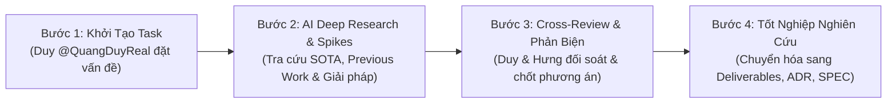

# ACDP R&D Tasks Hub: Nghiên Cứu & Định Hình Giải Pháp Kỹ Thuật

> **Phụ trách chính (Initiator / Author)**: Nguyễn Văn Quang Duy (@QuangDuyReal)  
> **Đồng phụ trách & Kỹ thuật (Co-author & Tech Lead)**: Đỗ Kiến Hưng (@darktheDE)  
> **Cán bộ hướng dẫn khoa học**: ThS. Trần Quang Khải  
> **Đơn vị**: Khoa Công nghệ Thông tin - Trường ĐH Sư phạm Kỹ thuật TP.HCM (HCMUTE)  
> **Chuyên ngành**: Kỹ thuật Dữ liệu (Data Engineering)

---

## 1. Giới Thiệu & Mục Đích Của Thư Mục `docs/rd-tasks/`

Trong giai đoạn đầu (R&D Phase) của đề tài **Tiểu luận chuyên ngành (TLCN)** và tiếp nối **Khóa luận tốt nghiệp (KLTN)**, việc nhảy ngay vào viết mã nguồn mà chưa khảo sát kỹ lưỡng sẽ dẫn đến nguy cơ đập đi xây lại, lãng phí thời gian và sai lệch hướng tiếp cận khoa học.

Thư mục [`docs/rd-tasks/`](./) là **vườn ươm nghiên cứu (Incubation Chamber)** chứa các bài toán nghiên cứu cốt lõi được khởi tạo bởi **Nguyễn Văn Quang Duy** (`@QuangDuyReal`). Mỗi task (ký hiệu `T01`, `T02`, `T03`,...) là một bài toán đặt ra nhằm:
1. Xác định rõ ràng các nút thắt nghiệp vụ và nghịch lý kỹ thuật còn vướng mắc.
2. Tiến hành điều tra khoa học trên các công trình nghiên cứu trước đây (Literature Review & Previous Work từ ACM, IEEE, VLDB, WWW).
3. Đề xuất kiến trúc giải pháp thích ứng, ma trận tính khả thi và lộ trình phát triển.
4. Tổ chức **nghiệm thu chéo (Cross-Review)** giữa Duy và Hưng để thống nhất 100% trước khi chuyển sang giai đoạn ban hành quyết định kiến trúc và lập trình.

---

## 2. Quy Trình Vòng Đời Của Một R&D Task (The 4-Stage Lifecycle)

Mỗi nhiệm vụ R&D trong thư mục này vận hành nghiêm ngặt qua 4 bước:



### Bước 1: Khởi tạo Task (Problem Inception by Duy)
- Duy xác định một trăn trở nghiệp vụ, nghịch lý dữ liệu hoặc rủi ro công nghệ cần tháo gỡ.
- Tạo file `TXX.md` theo chuẩn cấu trúc 3 câu hỏi kinh điển:
  - `Why this task exists ?`: Nêu rõ bối cảnh và vì sao không thể áp dụng cách làm thông thường.
  - `What should I do ?`: Xác định phạm vi câu hỏi nghiên cứu và nội dung cần phản biện.
  - `Expect result`: Đặt ra mục tiêu đầu ra cụ thể.

### Bước 2: Nghiên cứu chuyên sâu & Thiết kế giải pháp (Deep Research & Architectural Spike)
- Sử dụng phối hợp AI Pair Programming (Google Antigravity / Gemini CLI) cùng kỹ năng chuyên sâu:
  - Tra cứu các bài báo khoa học quốc tế uy tín (Google Scholar, ACM Digital Library, VLDB, IEEE Xplore).
  - Khảo sát các nền tảng thực tế trong công nghiệp (PredictHQ, Devpost, Lu.ma,...).
  - Xây dựng sơ đồ kiến trúc (Mermaid diagram), thuật toán xử lý dữ liệu và ma trận tính khả thi.
  - Cập nhật các nguồn trích dẫn học thuật vào [`docs/academic/references.bib`](../academic/references.bib).

### Bước 3: Nghiệm thu chéo giữa 2 thành viên (Cross-Review & Mutual Alignment)
- Cả hai thành viên đọc kỹ toàn bộ nội dung phản biện.
- Tranh luận và đối chất về tính khả thi thực tế trên tài nguyên hiện có (laptop 16GB RAM, tiến độ 15 tuần).
- Tích vào bảng kiểm tra xác nhận (**Cross-Review & Approval Checklist**) ở cuối task file.

### Bước 4: Tốt nghiệp nghiên cứu (Graduation to Engineering Specs)
Khi task được thông qua, kết quả nghiên cứu sẽ được "tốt nghiệp" và chuyển hóa thành các tài sản kỹ thuật chính thức:
- **Hồ sơ nghiệm thu Notion**: Lưu vết tại [`docs/deliverables/NT-XXX-[slug].md`](../deliverables/) và đồng bộ [`docs/tasks/notion-task-mapping.md`](../tasks/notion-task-mapping.md).
- **Quyết định kiến trúc bất biến**: Soạn thảo [`docs/adr/00XX-[slug].md`](../adr/).
- **Đặc tả kỹ thuật dữ liệu**: Soạn thảo [`docs/specs/00XX-[slug].md`](../specs/) (Pydantic Schema, API Contracts, Pipeline Definitions).
- **Luận văn tốt nghiệp**: Làm cơ sở cho Chương 2 (Cơ sở lý thuyết) và Chương 3 (Thiết kế hệ thống) của đồ án TLCN/KLTN.

---

## 3. Danh Mục Các Nhiệm Vụ R&D Hiện Có (Active R&D Catalog)

| Task ID | Tiêu đề & Nội dung Trọng tâm | Người Khởi tạo | Trạng thái Nghiên cứu | Tài liệu Nghiệm thu / Kế thừa |
| :---: | :--- | :---: | :---: | :--- |
| **[`T01.md`](./T01.md)** | **Phân tích Nghiệp vụ, Đánh giá Kỹ thuật và Đo lường Tính khả thi**<br>- Tháo gỡ 5 trăn trở nghiệp vụ (Search vs Ingestion, Vai trò Giảng viên, Cold-Start Review, Unstructured Text thành Analytics Data Marts, Tinh giản Lean Stack). | Duy (@QuangDuyReal) | ✅ Đã hoàn thành & Đã duyệt | - Deliverable: [`NT-013`](../deliverables/NT-013-business-technical-feasibility-review.md)<br>- Sprint: [`Sprint 01`](../tasks/active-sprint.md) |
| **[`T02.md`](./T02.md)** | **Khảo Sát Cuộc Thi, Phản Biện Khả Thi & Thiết Kế Kiến Trúc Thu Thập Thích Ứng Tổng Quát**<br>- Cơ sở khoa học: Cho & Garcia-Molina (Stanford), Chakrabarti, West & Dragut (VLDB 2026).<br>- Kiến trúc 4 trụ cột thu thập thích ứng (Adaptive Ingestion & Open Discovery).<br>- Lộ trình mở rộng địa lý 4 giai đoạn (HCMUTE $\rightarrow$ ĐHQG $\rightarrow$ TP.HCM $\rightarrow$ Miền Nam $\rightarrow$ Toàn quốc).<br>- Ma trận 8 chiều 18 cuộc thi tiêu biểu & 4 nút thắt sinh viên. | Duy (@QuangDuyReal) | 🔄 Sẵn sàng Cross-Review | - Deliverable: [`NT-014`](../deliverables/NT-014-competition-landscape-survey.md)<br>- Kế thừa: [`ADR-0002`](../adr/0002-generalized-adaptive-ingestion-architecture.md), [`SPEC-0002`](../specs/0002-data-ingestion-and-schema-spec.md) |

---

## 4. Hướng Dẫn Soạn Thảo Task Mới (`T03.md`, `T04.md`,...)

Khi Duy muốn đặt ra một bài toán nghiên cứu mới, hãy tạo file `docs/rd-tasks/TXX.md` theo cấu trúc mẫu dưới đây:

```markdown
# [TXX] Tiêu Đề Bài Toán Nghiên Cứu

> **Người thực hiện**: Đỗ Kiến Hưng (@darktheDE) & Nguyễn Văn Quang Duy (@QuangDuyReal)  
> **Cán bộ hướng dẫn khoa học**: ThS. Trần Quang Khải  
> **Đơn vị**: Khoa Công nghệ Thông tin - Trường ĐH Sư phạm Kỹ thuật TP.HCM (HCMUTE)  
> **Chuyên ngành**: Kỹ thuật Dữ liệu (Data Engineering)  
> **Hồ sơ nghiệm thu liên quan**: [Link tới docs/deliverables/ nếu có]

---

## 1. Why this task exists ?
[Mô tả bối cảnh, lý do bài toán nảy sinh và rủi ro nếu không giải quyết triệt để]

## 2. What should I do ?
[Các câu hỏi nghiên cứu, phạm vi khảo sát, bài toán cần giải quyết]

### PHẦN I: CƠ SỞ KHOA HỌC & CÁC CÔNG TRÌNH NGHIÊN CỨU TRƯỚC ĐÂY (PREVIOUS WORK)
[Trích dẫn các bài báo khoa học, lý thuyết toán/xác suất, công nghệ tương đương trên thế giới]

### PHẦN II: THIẾT KẾ GIẢI PHÁP KỸ THUẬT & KIẾN TRÚC
[Sơ đồ luồng dữ liệu Mermaid, thuật toán, schema dữ liệu hoặc giải pháp kiến trúc đề xuất]

### PHẦN III: ĐÁNH GIÁ TÍNH KHẢ THI & QUẢN TRỊ RỦI RO
[Bảng ma trận đánh giá tính khả thi, tài nguyên máy chủ, thời gian thực thi]

## 3. Expect result
[Liệt kê cụ thể sản phẩm đầu ra mong đợi]

---

## 4. Cross-Review & Approval Checklist
- [ ] **Review & Xác nhận bởi Đỗ Kiến Hưng (@darktheDE)**
- [ ] **Review & Xác nhận bởi Nguyễn Văn Quang Duy (@QuangDuyReal)**
- [ ] **Thống nhất thông qua để chuyển hóa sang tài liệu kỹ thuật chính thức**
```

---

## 5. Quy Định Bất Biến (Guardrails)

1. ❌ **Không tự ý code khi chưa cross-review**: Không bắt đầu viết mã nguồn cho các tính năng phức tạp nếu chưa có sự thống nhất và phê duyệt chéo của cả Duy và Hưng trên file R&D task tương ứng.
2. ❌ **Không suy diễn thiếu căn cứ khoa học**: Mọi đề xuất kiến trúc thu thập, trích xuất hay mô hình hóa dữ liệu đều phải có căn cứ từ các công trình nghiên cứu được trích dẫn trong [`docs/academic/references.bib`](../academic/references.bib) hoặc thực tiễn của các nền tảng hàng đầu thế giới.
3. ❌ **Không vi phạm quy chuẩn Git**: Mọi thao tác git (`git add`, `git commit`, `git push`) đều do 2 nhà phát triển con người thực hiện, tuyệt đối không chạy lệnh git tự động.
