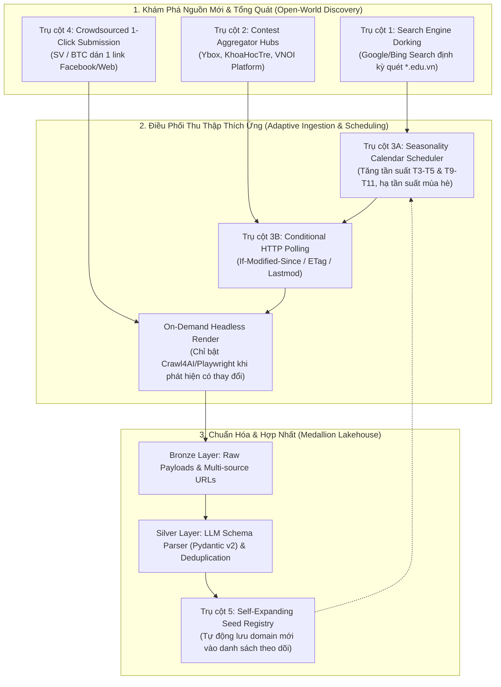
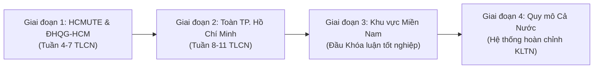

# [T02] Khảo Sát Cuộc Thi, Phản Biện Khả Thi & Thiết Kế Kiến Trúc Thu Thập Thích Ứng Tổng Quát

> **Người thực hiện**: Đỗ Kiến Hưng (@darktheDE) & Nguyễn Văn Quang Duy (@QuangDuyReal)  
> **Cán bộ hướng dẫn khoa học**: ThS. Trần Quang Khải  
> **Đơn vị**: Khoa Công nghệ Thông tin - Trường Đại học Công nghệ Kỹ thuật TP.HCM (HCM-UTE)  
> **Chuyên ngành**: Kỹ thuật Dữ liệu (Data Engineering)  
> **Hồ sơ nghiệm thu liên quan**:  
> - Deliverable khảo sát: [`docs/deliverables/NT-014-competition-landscape-survey.md`](../deliverables/NT-014-competition-landscape-survey.md)  
> - Quyết định kiến trúc: [`docs/adr/0002-generalized-adaptive-ingestion-architecture.md`](../adr/0002-generalized-adaptive-ingestion-architecture.md) *(Dự thảo)*  
> - Thư viện trích dẫn: [`docs/academic/references.bib`](../academic/references.bib)

---

## 1. Why this task exists ? (Đặt Vấn Đề & Phản Biện Nghiệp Vụ)

Trong quá trình thiết kế ban đầu, nhóm dự kiến cào dữ liệu định kỳ từ một danh sách cố định các trang web trường đại học. Tuy nhiên, qua quá trình phản biện nghiệp vụ và kỹ thuật dữ liệu, cách tiếp cận này bộc lộ **hai nghịch lý nghiêm trọng**:

1. **Nghịch lý Mùa vụ & Lãng phí Tài nguyên (Seasonality & Inefficient Polling)**:
   - Các cuộc thi học thuật không diễn ra dàn trải 365 ngày/năm mà phân bố tập trung thành **hai mùa cao điểm**:
     - *Mùa 1 (Học kỳ 2)*: Tháng 3 – Tháng 5 (Các giải Hackathon, Hội thi sáng tạo sinh viên, CTF An toàn thông tin).
     - *Mùa 2 (Học kỳ 1)*: Tháng 9 – Tháng 11 (Kỳ thi Olympic Tin học, ICPC, Giải thưởng Euréka, NCKH Sinh viên).
   - Nếu duy trì crawler chạy mù quáng 24/7 quét toàn bộ website quanh năm, **hơn 90% số lần cào sẽ trả về dữ liệu rỗng (không có cuộc thi mới)**. Điều này gây lãng phí nghiêm trọng tài nguyên CPU/RAM/Network của máy chủ và dễ kích hoạt cơ chế chặn IP từ tường lửa các trường đại học.
2. **Nghịch lý Nguồn Đóng & Phân Mảnh Kênh Truyền Thông (The Closed-World Assumption)**:
   - Nhiều khoa/trường đại học hiện nay **không đăng thông báo cuộc thi lên website chính thống của trường**, mà chỉ đăng tải trên Fanpage Đoàn - Hội, nhóm Zalo học thuật hoặc website riêng của câu lạc bộ sinh viên.
   - Khi một trường ngoài danh sách cào (hoặc một doanh nghiệp/tổ chức mới) phát động cuộc thi, hệ thống cào cứng sẽ **hoàn toàn "mù thông tin" (Zero Visibility)**, làm mất đi tính tổng quát của một nền tảng khám phá sự kiện.

👉 **Mục tiêu của Task T02**: Khảo sát thực tế hệ sinh thái cuộc thi, nghiên cứu các công trình khoa học (Previous Work) và thiết lập **Kiến trúc Thu Thập & Khám Phá Thích Ứng Tổng Quát (The 4-Pillar Generalized Ingestion Architecture)** kết hợp **Lộ trình Mở rộng Phân tầng Địa lý 4 Giai đoạn** để nhóm tiến hành **review chéo trước khi lập trình**.

---

## 2. What should I do ? (Nội Dung Nghiên Cứu & Phản Biện Chi Tiết)

---

### PHẦN I: CƠ SỞ KHOA HỌC & CÁC CÔNG TRÌNH NGHIÊN CỨU TRƯỚC ĐÂY (PREVIOUS WORK)

Bài toán tổng quát hóa thu thập và tối ưu hóa tài nguyên cào sự kiện đã được nghiên cứu sâu sắc trong các hội nghị và tạp chí khoa học máy tính hàng đầu thế giới:

#### 1. Lý thuyết Tối ưu hóa Tần suất Cào (Adaptive Crawling & Page Refresh Policy)
- **Công trình kinh điển của Junghoo Cho & Hector Garcia-Molina (Đại học Stanford - ACM Transactions on Database Systems, 2000 & 2003)**:
  - *Tài liệu*: [*"Effective Page Refresh Policies for Web Crawlers"*](https://doi.org/10.1145/945721.945723) và [*"Estimating Frequency of Change"*](https://doi.org/10.1145/775152.775217) (Trích dẫn: `\cite{cho2003refresh}`).
  - *Đóng góp*: Chứng minh bằng toán học xác suất rằng việc cào theo chu kỳ cố định (Uniform Polling) là hạ sách. Các tác giả xây dựng mô hình quá trình Poisson (Poisson Process Model) để crawler ước lượng tần suất thay đổi nội dung, ưu tiên băng thông cho các trang có xác suất biến động cao.
  - *Ứng dụng vào ACDP*: Đây là nền tảng toán học cho **Bộ lập lịch thích ứng theo Mùa vụ (Seasonality Scheduler)** và cơ chế **Conditional HTTP Polling** (`If-Modified-Since` / `ETag` $\rightarrow$ nhận mã `304 Not Modified` chỉ tốn $< 1\text{ KB}$ băng thông, CPU $0\%$).

#### 2. Khám phá Sự kiện Dẫn hướng bằng Truy vấn (Query-Driven Discovery & Focused Crawling)
- **Soumen Chakrabarti et al. (WWW 1999)**:
  - *Tài liệu*: [*"Focused Crawling: A New Approach to Topic-Specific Web Resource Discovery"*](https://doi.org/10.1016/S1389-1286(99)00052-3) (Trích dẫn: `\cite{chakrabarti1999focused}`) – Đặt nền móng cho kỹ thuật cào hướng chủ đề (Topic-specific resource discovery).
- **West & Dragut (Hội nghị VLDB 2026)**:
  - *Tài liệu*: [*"A Demo of Interactive Thematic Data Collection on the Live Web"*](https://www.vldb.org/) (Trích dẫn: `\cite{west2026interactive}`) – Thiết kế hệ thống đa tác tử sử dụng **vòng lặp tái gieo hạt (Re-seeding loop)** kết hợp với Search Engine Queries để liên tục khám phá các URL mới vượt ra ngoài tập danh sách cào ban đầu (beyond the immediate crawl frontier).
- **MDPI Applied Sciences (2023)**:
  - *Tài liệu*: [*"A Focused Event Crawler with Temporal Intent"*](https://doi.org/10.3390/app13042456) – Chứng minh việc đưa **ý định thời gian (Temporal Intent, ví dụ năm 2026)** vào truy vấn công cụ tìm kiếm giúp gom được hơn 92% sự kiện mới phát động mà không cần biết trước địa chỉ trang web.

#### 3. Mô hình Hệ thống Thực tế trong Công Nghiệp (Industry Precedents)
- **PredictHQ (Nền tảng Tình báo Sự kiện Toàn cầu - Demand Intelligence)**:
  - Xử lý hàng chục triệu sự kiện trên thế giới. PredictHQ không cào từng trường học hay địa điểm riêng lẻ. Họ cào từ các **Event Aggregator Hubs** kết hợp **Event-Driven Elastic Pipeline** (chỉ kích hoạt worker bóc tách sâu khi phát hiện có bài phát động mới).
- **Google Events (`Schema.org/Event`)**:
  - Tận dụng chính bộ máy tìm kiếm toàn cầu Google Search để phát hiện trang sự kiện mới từ hàng triệu domain lạ, sau đó chuẩn hóa vào cơ sở dữ liệu sự kiện.
- **Devpost, Lu.ma, ProductHunt**:
  - Vận hành cơ chế **Crowdsourced Submission with Instant Parsing**: Bất kỳ người dùng nào cũng có thể dán 1 URL $\rightarrow$ Hệ thống tự động phân tích và trích xuất bản xem trước trong 3 giây để người dùng xác nhận.

---

### PHẦN II: KIẾN TRÚC THU THẬP THÍCH ỨNG TỔNG QUÁT 4 TRỤ CỘT (THE 4-PILLAR ARCHITECTURE)

Nhóm thống nhất chuyển đổi hoàn toàn sang mô hình 4 trụ cột tổng quát:

1. **Trụ cột 1: Tự động Khám phá bằng Search Engine Dorking (Search-Driven Discovery)**:
   - Tận dụng Google/Bing đã index toàn bộ internet. Chạy định kỳ hàng tuần các query cấu trúc cao:
     - `site:*.edu.vn ("phát động cuộc thi" OR "thể lệ cuộc thi" OR "hackathon") 2026 -filetype:pdf`
     - `site:facebook.com/* ("thông báo số 1" OR "phát động") ("cuộc thi học thuật" OR "hackathon") CNTT 2026`
   - *Kết quả*: Mọi trường đại học lạ trên cả nước phát động cuộc thi mới đều tự động rơi vào `Discovery Queue`.
2. **Trụ cột 2: Thu hoạch từ các Trạm Trung chuyển Lớn (Contest Aggregator Hubs)**:
   - Thay vì cào 50 website trường, chỉ cần cào **3 Hub tổng hợp lớn nhất Việt Nam**:
     - *Ybox Cuộc thi* (`ybox.vn/cuoc-thi`): Đầu mối 90% cuộc thi sinh viên toàn quốc.
     - *Cổng Thành Đoàn & Trung tâm Phát triển KH&CN Trẻ* (`khoahoctre.com.vn`): Đầu mối thi học thuật TP.HCM.
     - *VNOI Platform* (`vnoi.info`): Đầu mối thi lập trình và thuật toán.
3. **Trụ cột 3: Bộ Lập lịch Thích ứng Mùa vụ & Kiểm tra Thay đổi (Adaptive Seasonality & Change Detection)**:
   - *Tiết kiệm 85% tài nguyên*: Không bật Playwright mù quáng. Gửi HTTP `HEAD` kiểm tra `ETag`/`If-Modified-Since` (nhận `304 Not Modified` chỉ tốn $<1\text{ KB}$) hoặc đọc Sitemap XML (`<lastmod>`). Chỉ khi có URL mới hoặc nội dung thay đổi mới bật trình duyệt render.
   - *Lịch mùa vụ*: Quét 1 lần/ngày vào tháng cao điểm (T3–T5, T9–T11), giảm xuống 1 lần/tuần vào mùa nghỉ hè (T6–T7).
4. **Trụ cột 4: Cơ chế Đóng góp Mở của Cộng đồng (Crowdsourced 1-Click Submission with Instant Parsing)**:
   - Cung cấp ô dán link trên giao diện Web ACDP. Bất kỳ sinh viên hoặc ban tổ chức nào dán link (link web hoặc post Facebook) $\rightarrow$ Crawl4AI + LLM tự động bóc tách thành bản xem trước có cấu trúc trong 3 giây.
5. **Trụ cột 5: Cơ chế Tự Mở Rộng Danh Mục Hạt Giống (Self-Expanding Seed Registry)**:
   - Khi phát hiện một cuộc thi mới uy tín từ domain lạ (`*.edu.vn`), hệ thống tự động ghi nhận domain vào bảng `monitored_sources` để đưa vào chu kỳ quét tự động tiếp theo.

---

### PHẦN III: LỘ TRÌNH MỞ RỘNG THU THẬP PHÂN TẦNG ĐỊA LÝ 4 GIAI ĐOẠN

Nhằm giúp việc kiểm soát chất lượng dữ liệu (Data Quality), đo lường độ trễ (Latency) và thuật toán khử trùng lặp (Deduplication) được phát triển bài bản từ nhỏ đến lớn:

1. **Giai đoạn 1 (Phase 1A - Baseline MVP | Tuần 4–7 TLCN)**:
   - Địa bàn: **HCMUTE và các trường thuộc ĐHQG-HCM** (UIT - ĐH Công nghệ Thông tin, HCMUT - ĐH Bách Khoa, HCMUS - ĐH Khoa học Tự nhiên).
   - Trọng tâm: Thiết lập chuẩn Pydantic schema, kiểm thử crawler trên các trang web quen thuộc và giải quyết bài toán DOM biến đổi.
2. **Giai đoạn 2 (Phase 1B - Regional Scale | Tuần 8–11 TLCN)**:
   - Địa bàn: **Toàn địa bàn TP. Hồ Chí Minh**.
   - Trọng tâm: Tích hợp các Hub cấp thành phố (Euréka, AI Challenge TP.HCM, Thành Đoàn), thử nghiệm thuật toán khử trùng lặp sự kiện đa nguồn (Deduplication trên DuckDB).
3. **Giai đoạn 3 (Phase 2A - Territorial Scale | Đầu Khóa luận tốt nghiệp)**:
   - Địa bàn: **Khu vực Miền Nam** (ĐH Cần Thơ, các trường đại học tại Đồng bằng Sông Cửu Long và Đông Nam Bộ).
   - Trọng tâm: Tối ưu hóa bộ lập lịch thích ứng theo mùa vụ (Seasonality Scheduler), thử nghiệm khả năng tự mở rộng danh mục hạt giống.
4. **Giai đoạn 4 (Phase 2B - National Scale | Hệ thống Hoàn chỉnh KLTN)**:
   - Địa bàn: **Quy mô Cả nước & Các Tập đoàn Công nghệ Lớn**.
   - Trọng tâm: Triển khai toàn diện Search Engine Dorking và Crowdsourced Submission để bao phủ toàn bộ các sân chơi cấp quốc gia (OLP, ICPC, Viettel VDT, Samsung SIC/SCPC, SV An ninh mạng NCA).

---

### PHẦN IV: BẢNG MA TRẬN KHẢO SÁT 8 CHIỀU 18 CUỘC THI TIÊU BIỂU

| STT | Tên Cuộc thi / Chương trình | Đơn vị Tổ chức | Khối Chuyên môn | Kênh Phát hành Dữ liệu | Định dạng Thể lệ | Chu kỳ (Mùa vụ) | Lộ trình Thu thập |
| :---: | :--- | :--- | :--- | :--- | :--- | :---: | :---: |
| **01** | **Hackathon HCMUTE Mở rộng** | Đoàn - Hội Khoa CNTT HCMUTE | Ứng dụng & AI/Web/IoT | Web `fit.hcmute.edu.vn` & Fanpage | HTML bài viết + Google Form | T3 – T5 (HK2) | **GĐ 1: HCMUTE** |
| **02** | **Mastering IT** | Khoa CNTT - HCMUTE | Kiến thức CNTT chuyên sâu | Fanpage Đoàn - Hội FIT HCMUTE | Poster ảnh + Caption chi tiết | T10 – T11 (HK1) | **GĐ 1: HCMUTE** |
| **03** | **Tuyển chọn OLP & ICPC HCMUTE** | Bộ môn KHMT - FIT HCMUTE | Thuật toán & CTDL | Website Khoa & VNOI Platform | HTML thông báo + PDF danh sách | T9 – T10 (HK1) | **GĐ 1: HCMUTE** |
| **04** | **UIT CTF / Wargame** | ĐH Công nghệ Thông tin (ĐHQG-HCM) | An toàn Thông tin | Cổng `inseclab.uit.edu.vn` & Fanpage | Web Dashboard CTF | T4 – T6 (HK2) | **GĐ 1: ĐHQG-HCM** |
| **05** | **Bach Khoa Innovation (BKI)** | ĐH Bách Khoa (ĐHQG-HCM) | Đổi mới sáng tạo & Dự án | Website `bk-innovation.hcmut.edu.vn` | PDF Thể lệ chi tiết | T1 – T4 (HK2) | **GĐ 1: ĐHQG-HCM** |
| **06** | **Giải thưởng Sinh viên NCKH – Euréka** | Thành Đoàn TP.HCM & ĐHQG-HCM | Nghiên cứu Khoa học (15 lĩnh vực) | Web `eureka.khoahoctre.com.vn` | Kỷ yếu PDF + Văn bản điều lệ | T7 – T11 (Hàng năm) | **GĐ 2: TP.HCM** |
| **07** | **AI Challenge TP.HCM** | Sở KH&CN, Sở TT&TT, ĐHQG-HCM | Trí tuệ Nhân tạo & Dữ liệu | Cổng `aichallenge.hochiminhcity.gov.vn` | PDF Thể lệ + API Benchmark | T6 – T10 (Hàng năm) | **GĐ 2: TP.HCM** |
| **08** | **Hội thi Tin học Trẻ TP.HCM (Bảng SV)** | Thành Đoàn TP.HCM | Thuật toán & Sáng tạo | Website `khoahoctre.com.vn` | Thông báo PDF + Văn bản liên tịch | T3 – T5 | **GĐ 2: TP.HCM** |
| **09** | **IoT Startup / Open Innovation** | Khu Công nghệ Cao TP.HCM (SHTP) | IoT, Phần cứng & AIoT | Website SHTP-IC | PDF Thể lệ + Form đăng ký | T5 – T9 | **GĐ 2: TP.HCM** |
| **10** | **Mekong AI & Big Data Challenge** | ĐH Cần Thơ & Sở KH&CN Cần Thơ | Khoa học Dữ liệu & AI | Cổng `ctu.edu.vn` | HTML thông báo + Thể lệ PDF | T8 – T11 | **GĐ 3: Miền Nam** |
| **11** | **Hội thi Sáng tạo Kỹ thuật ĐBSCL** | Liên hiệp các Hội KH&KT Miền Nam | Kỹ thuật & Ứng dụng | Cổng thông tin Liên hiệp Hội | Văn bản Word / PDF scan | T4 – T8 | **GĐ 3: Miền Nam** |
| **12** | **Olympic Tin học Sinh viên VN (OLP)** | Hội Tin học VN (VAIP) & Bộ GD&ĐT | Thuật toán (Chuyên/Không chuyên/AI)| Web chính thức `www.olp.vn` / `vnoi.info` | Quy chế PDF + Thông báo | T10 – T12 (Hàng năm) | **GĐ 4: Toàn Quốc** |
| **13** | **ICPC Vietnam Regional** | ICPC Global & Hội Tin học VN | Lập trình Quốc tế | Website `icpc.global` / `www.olp.vn` | Điều lệ chuẩn quốc tế (EN/VN) | T9 – T12 (Hàng năm) | **GĐ 4: Toàn Quốc** |
| **14** | **Sinh viên An ninh mạng (NCA)** | Hiệp hội An ninh mạng quốc gia (A05) | An toàn Thông tin & Dữ liệu | Cổng thông tin NCA / VNISA | Quy chế CTF (Attack-Defense) | T8 – T11 (Hàng năm) | **GĐ 4: Toàn Quốc** |
| **15** | **Viettel Digital Talent (VDT)** | Tập đoàn Viettel | Tài năng AI, Data, Cloud, Cyber | Website `tuyendung.viettel.vn` | HTML bài viết + Infographic | T2 – T5 (Hàng năm) | **GĐ 4: Toàn Quốc** |
| **16** | **Samsung Innovation Campus (SIC)** | Samsung Electronics Vietnam | Lập trình Thuật toán & IoT/AI | Cổng LMS & Research.samsung.com | Cổng LMS & Thể lệ điện tử | T4 – T8 | **GĐ 4: Toàn Quốc** |
| **17** | **SV NCKH Cấp Bộ Giáo dục & Đào tạo** | Bộ Giáo dục và Đào tạo | Nghiên cứu Khoa học Đa ngành | Cổng thông tin Bộ GD&ĐT (`moet.gov.vn`)| Thông tư & Công văn hành chính | T6 – T12 (Hàng năm) | **GĐ 4: Toàn Quốc** |
| **18** | **Shopee Code League** | Shopee Singapore & Vietnam | Thuật toán & Data Analytics | Cổng sự kiện Shopee Careers | Landing Page sự kiện | T3 – T4 | **GĐ 4: Toàn Quốc** |

---

### PHẦN V: KHẢO SÁT 4 ĐIỂM NGHẼN CỦA SINH VIÊN & GIẢI PHÁP KỸ THUẬT DỮ LIỆU

| Nút thắt thực tế | Biểu hiện cụ thể từ khảo sát | Giải pháp Kỹ thuật Dữ liệu (ACDP) |
| :--- | :--- | :--- |
| **1. Bỏ lỡ thời hạn đăng ký** | Thông tin trôi trên News Feed mạng xã hội; bài gia hạn chỉ đăng ở comment hoặc bài viết phụ. | Tự động trích xuất `registration_deadline`, nhận diện bài viết gia hạn để bật cờ `is_extended = True` và cảnh báo mốc thời gian. |
| **2. Quá tải thể lệ phức tạp** | Thể lệ dài từ 10–30 trang PDF; sinh viên đọc không kỹ dẫn đến vi phạm quy chế (sai bảng đấu, sai số lượng thành viên). | Phân đoạn thể lệ, đánh chỉ mục vector trên Qdrant; luồng Hybrid RAG trả lời chính xác điều kiện dự thi kèm trích dẫn số trang/điều khoản. |
| **3. Khó khăn tìm đồng đội bổ trợ** | Sinh viên năm 1-2 thiếu network; sinh viên mạnh thuật toán/AI thiếu bạn làm Web/Frontend và ngược lại. | Thuật toán ghép đội dựa trên độ tương đồng vector kỹ năng bù trừ (Complementary Skill Matchmaking). |
| **4. Thiếu dữ liệu bài thi cũ** | Sinh viên mới không biết mức độ khó của đề thi, quy cách trình bày bài làm đạt giải của các năm trước. | Kho tri thức lịch sử (Seed Knowledge) nạp sẵn 15–20 bộ đề mẫu ICPC, Euréka và write-up của các đội quán quân năm trước. |

---

## 3. Expect result (Sản Phẩm Đầu Ra & Chuẩn Bị Triển Khai)

1. Cung cấp bộ cơ sở lý luận khoa học có trích dẫn chuẩn (`Cho & Garcia-Molina`, `Chakrabarti`, `West & Dragut`) phục vụ soạn thảo Chương 2 (Cơ sở lý thuyết) và bảo vệ luận văn trước Hội đồng chuyên ngành Kỹ thuật Dữ liệu.
2. Cung cấp kiến trúc đầu vào để ban hành:
   - [`docs/adr/0002-generalized-adaptive-ingestion-architecture.md`](../adr/0002-generalized-adaptive-ingestion-architecture.md).
   - [`docs/specs/0002-data-ingestion-and-schema-spec.md`](../specs/0002-data-ingestion-and-schema-spec.md).
3. Tài liệu hoàn thiện để hai thành viên **Đỗ Kiến Hưng** và **Nguyễn Văn Quang Duy** tiến hành review chéo, thống nhất trước khi code.

---

## 4. Cross-Review & Approval Checklist

Tài liệu đã sẵn sàng để hai thành viên thực hiện nghiệm thu chéo:

- [ ] **Review & Xác nhận bởi Đỗ Kiến Hưng (@darktheDE)**
- [ ] **Review & Xác nhận bởi Nguyễn Văn Quang Duy (@QuangDuyReal)**
- [ ] **Thống nhất thông qua để ban hành ADR-0002 và lập trình SPEC-0002**
